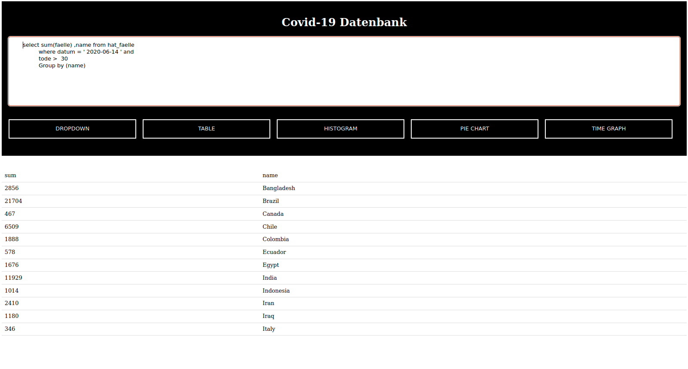
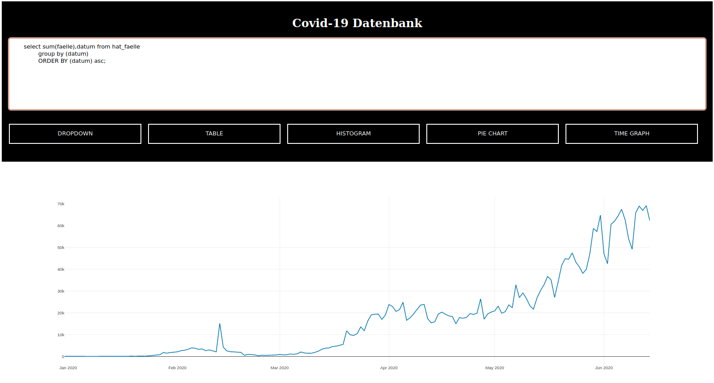
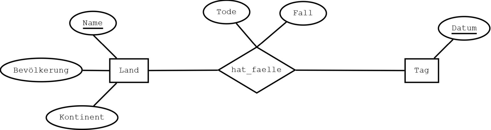
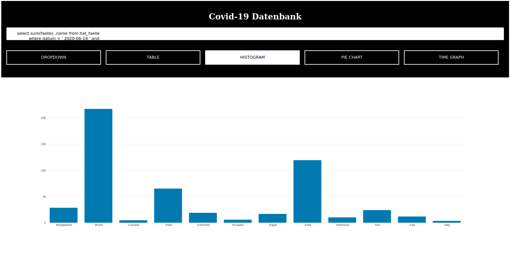
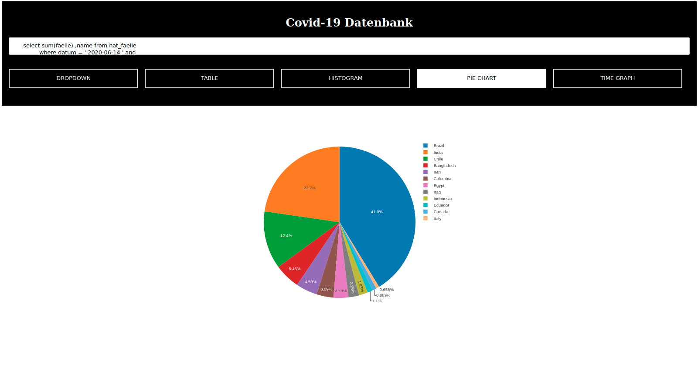

# Roguelike in Rust
<p float="left">
    
    
</p>
This repository offers a script for cleaning a provided COVID-19 dataset and visualizing its data through graphics on an HTML website.

## Table Of Content

- [Course content](#course-content)
- [Grading](#grading)
- [Getting Started](#getting-started)
  - [Dependencies](#dependencies)
  - [Installation](#installation)
  - [Compile and run](#compile-and-run)
- [ER Model](#er-model)
- [Example pictures](#example-pictures)
- [Contribution](#contribution)


## Course content

The purpose of this project is to further explore and solidify the concepts learned in the Database Systems course. Project for the Database Systems module. The goal is to represent a given dataset using graphs. To achieve this, the data needs to be cleaned first, then transferred to a database, and finally connected to a self-developed webpage that visually represents the data.


## Grading

| Assignment  | Grade |
| ------------- | ------------- |
| Project  | 94% -> 1.3  |


## Getting Started 

### Dependencies
* python 2 (python 2.7.18)
 * java 11 (openjdk 11.0.19)
 * javac 11 (openjdk runtime enviroment 11.0.19)
 * psql 14.8 (postgresql 14.8)
 * [jdbc postgresql driver 42.6.0 ](https://jdbc.postgresql.org/download/)
 * optional: pgadmin4
 * optional: eclipse


## installation
 1. Execute the dataset cleaner script with the dataset located in the same directory `python2 convert.py`
 2. Create the ER model using PostgreSQL. For example, run the following SQL code:
```
CREATE TABLE Land (
	Name varchar(100) PRIMARY KEY,
	Bevoelkerung int,
	Kontinent varchar(100)
);

CREATE TABLE Tag (
	Datum date PRIMARY KEY
)

CREATE TABLE hat_faelle (
	Datum date,
	Faelle int,
	Tode int,
	Name varchar(100),
	primary key (Datum, Name),
	foreign key (Datum) references Tag(Datum),
	foreign key (Name) references Land(Name)
);
```
 3. Import the three CSV files generated in step 1 into the PostgreSQL database.
 4. Modify the 'HttpServer.java' file to match your PostgreSQL setup by changing the username, password, and database name in that file.
 5. Add the JDBC driver to your project, for example, by including it in the project libraries in Eclipse.

## Compile and run

1. Run the Java project 'http_website' (e.g. with Eclipse).
2. Visit the website by accessing `127.0.0.1:8080`

## ER Model
<p float="left">
    
</p>

## TODO Example pictures
<p float="left">
    
    
    
    
</p>

## Contribution

* Thore Brehmer - projekt task: dev. website with graphs + connection to sql database to retrieve data
* Jonny Lam - projekt task: data cleaning (removing small dataset errors)
* David Lee - projekt task: import data to sql database
